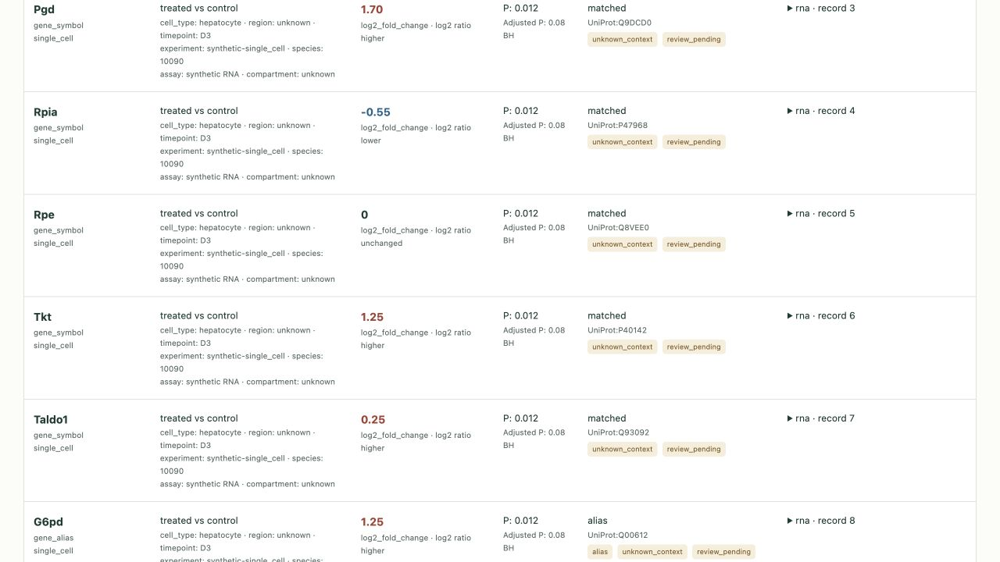

# PathwayBridge

**把多组学结果放到同一条反应背景中，并保留每一条证据的来处。**

[English](README.md) · [输入格式](docs/input-contract.md) · [映射规则](docs/mapping-policy.md)

已发布 [**0.1.0a3 探索测试版**](https://github.com/guatou904/pathwaybridge/releases/tag/v0.1.0a3)：支持小鼠 PPP 的 7 条精选反应，以及 bulk RNA、单细胞、空间和代谢物结果表。GitHub 发行和下载后的安装回验已完成；完整通路覆盖、独立科学评审和 PyPI 发布尚未完成。

例如，`Pgd` 在两个空间区域中一升一降，代谢物名称又无法区分异构体。PathwayBridge 会保留这些不同来源的观测，并列出候选映射，不把它们合成一个“通路激活分数”。



## 先跑一个演示

**直接体验：[在线交互演示](https://guatou904.github.io/pathwaybridge/)** · [下载完整演示 ZIP](https://guatou904.github.io/pathwaybridge/pathwaybridge-demo.zip)

在线演示使用合成数据，可以搜索、筛选、展开原始记录和下载结果。它是报告示例；分析自己的数据请使用下方的本地工具。ZIP 解压后双击 `report.html`，并保留旁边的导出文件。

需要 Python 3.11 或更新版本。分析过程不依赖其他 Python 包，也不访问网络；浏览器预览只连接本机。

```sh
python -m venv .venv
# macOS / Linux
source .venv/bin/activate
# Windows PowerShell: .venv\Scripts\Activate.ps1
python -m pip install "https://github.com/guatou904/pathwaybridge/releases/download/v0.1.0a3/pathwaybridge-0.1.0a3-py3-none-any.whl"
pathwaybridge demo --out demo-run --open
```

浏览器会自动打开。查看时请保持终端窗口开启；按 `Ctrl+C` 停止。以后重新打开同一份报告：

```sh
pathwaybridge serve --report demo-run/report
```

程序会选择空闲端口，并在终端显示地址。如果浏览器未自动打开，可复制该地址。这个 `127.0.0.1` 地址只在本次查看期间有效；关闭后请重新运行 `serve`。报告文件会一直保留，也可以直接打开 `demo-run/report/report.html`。只生成报告时，省略 `--open`。

## 导入自己的结果

```sh
pathwaybridge init --out my-inputs
# 编辑 my-inputs/manifest.json，填写数据文件、列名与分析背景。
pathwaybridge validate --manifest my-inputs/manifest.json
pathwaybridge build --manifest my-inputs/manifest.json --out my-report --open
```

输入是上游分析已完成的 CSV/TSV。配置文件将原表列名映射到统一字段，也可以明确填写常量，例如物种 `10090`、比较方向、效应类型和单位。只提供一种模态也可以运行。输出目录必须是新目录；程序不会覆盖或删除旧结果。

请先核对上游含义：`logFC` 的底数、比较的分子/分母、`comparison` 究竟表示组间比较还是时间点、P 值是否校正，都不能只根据列名猜测。

## 会得到什么

| 输出 | 用途 |
|---|---|
| `report.html` | 离线可搜索报告、反应视图和原始记录 |
| `evidence.json` | 完整证据、全部原始字段、映射候选、文件哈希 |
| `evidence.tsv` | 一条输入记录对应一行 |
| `reaction_evidence.tsv` | 展开后的候选实体—反应关系 |
| `issues.tsv` | 别名、歧义、未支持物种/ID、缺失背景、重复记录和复核提示 |
| `mapping.json`、`pathway.svg` | 本次映射快照与反应图 |
| `SHA256SUMS` | 输出文件的 SHA256 校验值 |

`source_record` 是去掉表头后从 1 开始的记录编号；`source_line_end` 是原文件中记录结束的物理行号。带换行的 CSV 单元格可能跨多行，因此两者分别保存。每个文件都有 SHA256，每条记录都保留原始字段字符串。

## 怎样解读

- `matched`：在当前有限参考中精确对应一个实体。该实体可以关联多条反应，这并非多个独立样本。
- `alias`：找到一个别名候选，需要核对身份。`ambiguous`：存在多个候选，全部保留。
- `unmapped`：当前参考未覆盖该 ID，不能解释成未表达、未检测到或通路无活性。
- 不支持的物种和 namespace 单独列出，不会自动跨物种转换或修改基因名大小写。
- 正式基因符号与历史别名分开处理：`Tkt` 的历史别名检索还会命中 PPP 之外的 `Ddr2`；化合物简称也不等于已确认其异构体或氧化还原态。
- 保留细胞类型、区域、时间点、实验、比较、单位和上下游复核状态。原记录被排除时仍可追溯，不会因映射成功变成可信证据。
- 原始 P 和校正后 P 分开显示；数值不做平均、舍入或跨模态合并。表达和代谢物丰度不能直接推出代谢通量。

当前参考并非完整 PPP：第二条转酮醇酶反应、其他同工酶、跨膜转运和 PRPP 等分支暂不覆盖。数据库注释中的“同源推断”仍保持该证据等级，不能当作已在小鼠直接实验验证。

## 当前交付状态

`0.1.0a3` 修复演示入口：新增 `serve` 和 `--open`，发行包提供完整演示 ZIP，在线演示由 GitHub Pages 托管。[本次修复与验证](docs/report-access-fix.md)。

本地功能、测试、合成演示和真实输入格式回验见[验证记录](docs/validation-record.md)。真实研究数据只在本地忽略目录使用，不随软件包分发。真实输入跑通不等于研究结论已通过科学评审。

[0.1.0a3 发布流程](https://github.com/guatou904/pathwaybridge/actions/runs/34824761130) 已实际成功：Linux/macOS/Windows × Python 3.11/3.12/3.13，每组 48 项测试通过，并验证 wheel/sdist 安装、报告访问和关闭后重新打开。发布文件也已下载回验。[发布清单](RELEASE_CHECKLIST.md)。

代码采用 [MIT](LICENSE)。参考注释来自 UniProt Consortium `2026_03`，沿用 CC BY 4.0，包含其 Rhea/ChEBI 交叉引用；筛选、角色标签和候选别名属于本项目适配。[数据来源与授权](docs/data-sources.md)。
